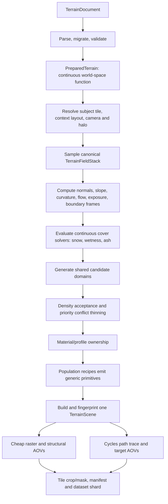

# Groundwork Terrain Generation System
## Low-Fidelity Semantic Field Stack to High-Fidelity Isometric Tile

**Status:** Proposed implementation specification  
**Repository assessed:** `BackseatWarlord-main-2026-08-05T06-46-01-182Z-3767de67.xml`  
**Assessment method:** Static review of the supplied repository snapshot, its architecture documents, authored terrain documents, and relevant source paths. The repository was not built or executed as part of this assessment.

---

## 1. Executive decision

The overall idea is sound, and the repository is already pointed in the correct architectural direction. The most important concepts are present:

- an authored semantic terrain document;
- a deterministic continuous sampler in world metres;
- normalized material weights, modifier channels, elevation, and microrelief;
- an edge-anchored ground grid intended to be shared by renderers;
- a renderer-neutral scene representation;
- generic population recipes and addressed randomness;
- a cheap raster tier, a Cycles tier, and a paired-dataset contract;
- a nine-tile isometric composition with a subject tile in the centre.

The main problem is not that the design is missing. The problem is that the practical render path is still split between two generations of the system:

1. the **new generic architecture**, which has `PreparedTerrain`, `GroundSurface`, `TerrainScene`, generic marks, instances, manifests, and a generic Cycles package; and
2. the **old grass-specific implementation**, in which `WorldField`, `GrassScene`, `BakeParams`, the current cheap renderer, the current CLI render path, and much of the current dataset path still decide what is actually rendered.

The next phase should therefore **not** begin by adding snow directly to the old grass renderer. It should begin by completing the missing compiler bridge:

```text
PreparedTerrain
    -> sampled semantic field stack
    -> derived terrain fields and cover solvers
    -> shared deterministic candidate domains
    -> population ownership and recipe emission
    -> one generic TerrainScene
    -> cheap render and high-fidelity render of that same scene
```

Once that bridge exists, grass, dirt, multiple grass detail families, snow, flowers, rocks, debris, and later cliffs become content and solver work rather than repeated architectural work.

### Overall readiness estimate

These percentages are engineering estimates from static review, not measured completion figures.

| Area | Estimated readiness | Assessment |
|---|---:|---|
| Authored semantic document and validation | 85% | Strong and well reasoned. Needs cover-layer and derived-source extensions. |
| Continuous `PreparedTerrain` sampler | 80% | Materials, elevation, microrelief, and modifiers exist. Some derivatives and feature context remain unimplemented. |
| Low-fidelity matrix representation | 75% | `GroundSurface` is almost exactly the required concept, but no production builder makes it canonical end to end. |
| Generic scene intermediate representation | 80% | Good primitive vocabulary, stable order, fingerprints, ground, instances, and material bindings. |
| Population recipe framework | 55% | Strong interfaces and candidate identity; integration and shared ownership are incomplete. |
| Shared material-boundary placement | 15% | Correct design is documented, but the shared candidate field is deliberately absent. |
| Generic cheap renderer | 25% | A sophisticated grass rasterizer exists, but it does not yet consume the generic scene as its normal path. |
| Generic Cycles path | 65% | Generic export/package infrastructure exists; active rendering still includes grass-specific paths. |
| Grass content | 65% | The existing look is advanced, but it remains tied to the legacy generator and is not yet decomposed into reusable terrain profiles. |
| Dirt content | 20% | Semantic material and minimal grit exist; finished appearance and structure do not. |
| Snow | 0–5% | No first-class cover model or accumulation solver exists. The architecture can accommodate one after the compiler bridge. |
| Tile-shaped neural dataset contract | 35% | One-scene pairing and manifests are strong; the active corpus is still partly page/grass-shaped. |
| Authoring and diagnostic tooling | 60% | Validation and inspection are strong; field-stack and ownership visualizers are the next requirement. |

**Practical conclusion:** the system is approximately **70% of the way to the right architecture**, but only approximately **30% of the way to a usable, integrated grass + dirt + snow low-to-high-fidelity terrain product**.

---

## 2. Product contract

The system needs an unambiguous contract before more content is added.

### 2.1 What the user authors

The author edits a **continuous semantic terrain description**. It may be procedural, painted, spline-driven, or assembled from imported rasters. It does not directly contain final geometry and it does not contain a final RGB texture.

The author may express, independently:

- base elevation;
- fine microrelief;
- substrate material weights;
- grass and other vegetation density;
- grass morphology and species/profile mixture;
- path, boundary, and region features;
- snow input, depth, compaction, and melt state;
- moisture, exposure, flow, occlusion, and other environmental modifiers;
- sparse populations such as rocks, flowers, grit, sticks, and debris.

### 2.2 What “low fidelity” means

The low-fidelity representation is a **typed, multi-channel, top-down field stack** sampled over a world-space grid.

It is not merely a low-resolution colour image. An RGB image cannot tell the next stage whether a dark patch means:

- lower ground;
- wet dirt;
- shadow;
- dense grass;
- a snow-free hole;
- a different substrate;
- or a painted colour variation.

Those meanings must remain separate until geometry, material ownership, and lighting are resolved.

A cheap RGB preview is generated from this field stack, but the RGB preview is a derivative, not the source of truth.

### 2.3 What “high fidelity” means

High fidelity means:

- the same semantic field stack;
- the same accepted candidate identities;
- the same population ownership;
- the same scene primitives and instances;
- more accurate tessellation, materials, shadows, occlusion, subsurface/transmission, and light transport.

High fidelity must not mean “generate a second, more detailed terrain.” It means “render the one terrain more accurately.”

### 2.4 What a tile is

The **product unit** is one isometric subject tile.

The **generation unit** is not one isolated tile. It is:

- the subject tile;
- its eight immediate context tiles;
- plus a derived halo large enough for vegetation reach, shadows, snow transport, filtering, and other neighbourhood operations.

The continuous scene is generated once over the whole region. The middle tile is then masked or cropped as the product.

```text
        generated continuously
    ┌────────┬────────┬────────┐
    │context │context │context │
    ├────────┼────────┼────────┤
    │context │SUBJECT │context │   + derived halo outside this diagram
    ├────────┼────────┼────────┤
    │context │context │context │
    └────────┴────────┴────────┘

    output/product: the subject diamond
    generation: all nine tiles and the halo
```

This preserves cross-tile blades, shadows, snow drifts, flow fields, and boundary continuity. “Single-tile workflow” should therefore mean **single-tile output and authoring focus**, not single-tile generation.

---

## 3. Non-negotiable invariants

The following should become acceptance gates for all future terrain work.

### 3.1 Semantic determinism

For a fixed document, root seed, recipe versions, and world position, the semantic answer is identical regardless of:

- process;
- thread count;
- page layout;
- render tile layout;
- crop size;
- whether neighbouring regions were generated at the same time.

### 3.2 Addressed randomness only

No terrain decision may depend on “the next random number.” Every random value must be addressed by stable identity:

```text
root seed
+ candidate domain
+ world cell
+ candidate rank
+ child rank
+ named stream
+ recipe version
```

Adding a new random decision must add a new stream name. It must not insert another positional draw into an existing sequence.

### 3.3 One semantic scene

The cheap renderer and Cycles consume one immutable `TerrainScene`, ideally behind one `Arc<TerrainScene>`. No public API should accept two independently generated scenes for a training pair.

### 3.4 Tiles never decide generation

World tiles decide framing, subject weighting, masks, cache addresses, and output naming. They never decide which grass, dirt, rocks, or snow exist.

### 3.5 Materials blend before rendering

Material blending operates on semantic weights and candidate ownership. Final rendered images are never blended to simulate a terrain boundary.

### 3.6 Continuous layers and discrete populations remain separate

Layers answer “what is here?” Populations answer “which countable things exist here?” A population must never write material weights or a layer field.

### 3.7 Quality tiers change measurement, not meaning

A lower quality tier may use:

- fewer tessellation ribs;
- fewer shadow samples;
- lower AOV precision;
- coarser filtering;
- simpler shaders;
- reduced supersampling.

It may not change:

- candidate identity;
- candidate acceptance;
- material ownership;
- root position;
- mark family;
- scene topology at the semantic level.

### 3.8 Explicit units and interpolation

Every matrix channel has declared:

- units;
- legal range;
- composition rule;
- filtering rule;
- border rule;
- semantic group;
- digest quantization.

A categorical channel may not be bilinearly interpolated. A direction field may not be averaged like an ordinary scalar without renormalization.

---

## 4. Canonical end-to-end pipeline

The canonical pipeline should be implemented as follows.



### Stage 1: Parse, migrate, validate, prepare

This part largely exists. Extend it only where the new semantic model requires first-class cover layers, candidate domains, and derived sources.

### Stage 2: Resolve the render request

Resolve one `SceneRequest` containing:

- subject tile coordinate;
- tile side in metres;
- context layout;
- projected output size;
- pixels per metre;
- visible bounds;
- generated bounds;
- semantic LOD;
- derived halo.

The halo must be the maximum of all relevant reaches, not a fixed guess:

```text
halo = max(
    source reach,
    recipe maximum reach,
    shadow caster reach,
    snow transport reach,
    filter support,
    ground tessellation support,
    transition recipe reach
)
```

### Stage 3: Build the field stack once

Sample `PreparedTerrain` onto one edge-anchored grid. The grid includes generated bounds, not only visible bounds.

All renderers and population samplers interpolate from this same stack. They do not independently call `PreparedTerrain` at their own rates.

### Stage 4: Compute derived fields

Compute feature fields from the sampled structural channels once:

- ground normal;
- slope magnitude;
- aspect/facing direction;
- mean and Gaussian curvature or practical approximations;
- concavity/convexity;
- sky exposure or terrain occlusion;
- flow accumulation and direction;
- local roughness;
- dominant substrate pair;
- material blend amount;
- material boundary normal and tangent;
- feature signed distance and tangent where available.

These fields become reusable masks for vegetation, snow, moisture, dirt sorting, erosion, and debugging.

### Stage 5: Solve continuous covers

Snow and similar surface covers are continuous fields, not populations. Solve them before discrete vegetation visibility and final ground geometry are resolved.

### Stage 6: Generate candidates by domain

Generate each shared candidate domain once over generated bounds. Examples:

- `vegetation.tuft_anchor`;
- `vegetation.fine`;
- `vegetation.emergent`;
- `surface.grit`;
- `surface.debris`;
- `rock.large`.

### Stage 7: Accept, thin, and assign ownership

Use stable random thresholds and stable conflict priorities. Candidate acceptance and ownership are independent operations.

### Stage 8: Emit scene primitives

Recipes emit renderer-neutral primitives. The compiler assigns stable IDs, material bindings, bounds, and painter order.

### Stage 9: Render the same scene at two budgets

The cheap renderer and Cycles receive the same field stack and semantic scene. The cheap renderer may simplify representation but cannot regrow content.

### Stage 10: Crop and package

Crop or mask to the subject tile only after all neighbourhood-dependent work is complete. Write manifests, AOVs, and fingerprints beside the render.

---

## 5. The canonical matrix: `TerrainFieldStack`

The current `GroundSurface` is already close to this requirement. It has an edge-anchored lattice, elevation, microrelief, dense material planes, and modifier planes. The recommended change is to evolve that concept into the canonical end-to-end matrix rather than create a competing image representation.

### 5.1 Proposed type

```rust
pub struct TerrainFieldStack {
    pub grid: FieldGridSpec,

    // Structural ground
    pub elevation_m: ScalarPlane,
    pub microrelief_m: ScalarPlane,

    // Mutually exclusive base ground
    pub substrate_weights: Vec<MaterialPlane>,

    // Independent continuous covers
    pub covers: Vec<CoverPlane>,

    // Authored and composed control fields
    pub modifiers: Vec<ModifierPlane>,

    // Compiler-derived fields
    pub derived: DerivedFieldSet,
}

pub struct FieldGridSpec {
    pub origin: WorldPoint,
    pub spacing_m: f64,
    pub rows: u32,
    pub columns: u32,
    pub anchor: TexelAnchor, // Edge for canonical terrain grids
    pub row_order: RowOrder,
}

pub struct ScalarPlane {
    pub values: Vec<f32>,
    pub descriptor: FieldDescriptor,
}

pub struct FieldDescriptor {
    pub key: String,
    pub unit: FieldUnit,
    pub range: Option<(f32, f32)>,
    pub filter: FieldFilter,
    pub border: FieldBorder,
    pub digest_steps_per_unit: f64,
}
```

### 5.2 Edge anchoring

A grid of `columns × rows` cells contains `(columns + 1) × (rows + 1)` samples. Adjacent grids share their complete boundary row or column exactly.

This must remain the canonical arrangement for:

- elevation;
- microrelief;
- continuous material weights;
- snow depth;
- scalar modifiers;
- derived scalar fields.

Cell-centred matrices may be used for candidate occupancy and per-cell diagnostics, but they must be explicitly different types.

### 5.3 Grid resolution

The matrix should be resolution-aware but not tied to final pixels.

For the current default of a 2 m subject tile with a 3×3 context layout, the visible world is approximately 6 m across before halo. Practical initial tiers are:

| Tier | Approximate spacing | Approximate samples across 6 m | Purpose |
|---|---:|---:|---|
| Interactive draft | 4–6 cm | 101–151 | Fast authoring masks and preview. |
| Dataset/default | 2–3 cm | 201–301 | Path boundaries, snow, dirt variation, and population sampling. |
| Reference | 1–2 cm | 301–601 | Close inspection and high-frequency cover geometry. |

These are starting targets, not permanent constants. The resolver should derive spacing from:

- output pixels per metre;
- smallest declared field bandwidth;
- cover solver requirements;
- maximum allowed samples;
- quality tier.

A reasonable rule is:

```text
spacing_m = clamp(
    min(declared_feature_width_m / samples_per_feature,
        1 / semantic_samples_per_screen_metre),
    min_spacing_m,
    max_spacing_m
)
```

The canonical fine stack is sampled once. Coarser previews and mips are area-filtered derivatives of it where possible, rather than independent resampling passes that can shift boundaries.

### 5.4 Channel groups

#### A. Structural ground

- `elevation_m`
- `microrelief_m`
- optional `bedrock_elevation_m`
- optional `compaction_displacement_m`

#### B. Substrate material weights

Mutually exclusive and normalized:

- soil;
- compacted dirt;
- mud;
- rock;
- sand;
- gravel.

At every sample:

```text
sum(substrate_weights) = 1
```

#### C. Vegetation control fields

Not base materials:

- `vegetation_density`
- `grass_tuft_density`
- `grass_fine_density`
- `grass_thatch_density`
- `grass_broadleaf_density`
- `grass_dryness`
- `grass_height_scale`
- `grass_flow_u`, `grass_flow_v`
- `flower_abundance`
- `weed_abundance`

#### D. Cover fields

Independent of substrate normalization:

- `snow_depth_m`
- `snow_coverage`
- `snow_compaction`
- `snow_age`
- `snow_melt`
- later `ash_depth_m`, `leaf_litter_depth_m`, or `water_depth_m`.

#### E. Environmental fields

- moisture;
- temperature;
- light exposure;
- wind exposure;
- traffic/trampling;
- nutrient/richness;
- disturbance;
- erosion/flow.

#### F. Derived fields

- normals;
- slope;
- aspect;
- curvature;
- concavity;
- occlusion;
- flow accumulation;
- flow direction;
- dominant material pair;
- blend strength;
- boundary tangent and normal.

### 5.5 Memory

A `257 × 257` plane contains 66,049 `f32` values, about 258 KiB. Twenty planes are approximately 5 MiB; forty planes are approximately 10 MiB. That is acceptable for an offline scene compiler and a tile-focused editor, especially when inactive material planes are omitted.

Use `f32` in the canonical in-memory representation. Quantize only for cache storage, manifests, or GPU upload, with the quantization recorded.

---

## 6. Semantic separation: substrate, vegetation, and cover

This is the most important modelling change for the next phase.

### 6.1 Substrate

Substrate answers: **what continuous ground is beneath everything?**

Examples:

- compacted dirt;
- loose soil;
- rock;
- mud;
- sand.

Substrate weights normalize to one and drive:

- ground material;
- continuous displacement character;
- moisture response;
- compaction response;
- population affinity.

### 6.2 Vegetation

Vegetation answers: **what discrete canopy grows out of the substrate?**

Grass is principally a population controlled by density and morphology fields. This allows the same grass family to grow sparsely on dirt, thickly on meadow soil, in cracks on stone, or through shallow snow without inventing a separate base material for every combination.

The current `grass_lush` material can remain during migration, but the target model should separate:

```text
substrate: meadow_soil
vegetation profile: grass_lush
```

rather than making “grass” the only identity of the ground itself.

### 6.3 Cover

Cover answers: **what continuous material lies over the substrate and around populations?**

Snow must be a cover because it can lie over both grass and dirt while preserving what is underneath. It has depth, coverage, and surface geometry. It is not simply a third mutually exclusive substrate weight.

### 6.4 Visible-surface resolution

The renderer resolves the visible surface in this order:

1. structural elevation and microrelief;
2. substrate material mixture;
3. continuous covers and their depth;
4. discrete roots, blades, rocks, debris, and emergents;
5. interaction between covers and discrete geometry;
6. lighting.

This order makes “snow on grass on soil” a meaningful state rather than a colour blend among three unrelated images.

---

## 7. Material and boundary blending

### 7.1 Base weights

Continue using unbounded material scores during layer composition, followed by one normalization at the end.

### 7.2 Never generate a full population per material

The following is forbidden:

```text
full grass population × grass weight
+ full dirt-detail population × dirt weight
```

It produces doubled density and fractional geometry. A sparse transition is not a collection of transparent blades.

### 7.3 Shared candidate ownership

For each candidate domain:

1. generate a stable candidate;
2. calculate blended target density;
3. accept or reject once;
4. calculate compatible owner weights;
5. make one stable categorical ownership draw;
6. emit only the winning recipe’s content.

For candidate `c` and owner `k`:

```text
owner_score_k(c) =
    profile_weight_k(c)
  × substrate_affinity_k(c)
  × abundance_k(c)
  × boundary_adjustment_k(c)
```

Normalize positive owner scores and choose with one stable `owner` random value.

### 7.4 Pair-specific transition recipes

A grass–dirt transition may add:

- clipped or sparse edge blades;
- exposed roots;
- loose soil;
- grit concentrated at the fringe;
- an irregular boundary width.

That treatment may decorate a boundary. It must not decide where the boundary is. The normalized semantic weights remain authoritative.

### 7.5 Boundary frame

At every mixed point, derive:

```rust
pub struct BoundaryFrame {
    pub primary: MaterialIndex,
    pub secondary: MaterialIndex,
    pub blend: f32,
    pub normal: [f32; 2],
    pub tangent: [f32; 2],
    pub signed_bias: f32,
}
```

This supports:

- grass leaning away from a track;
- stones aligned along an edge;
- ruts parallel to a path;
- snow feathering across a material transition;
- detail anisotropy without recomputing feature geometry in each recipe.

---

## 8. Shared candidate domains

The current candidate model is a strong foundation, but its identity contains the population. That prevents two populations from sharing the same field. Introduce a higher-level candidate domain independent of material and recipe.

### 8.1 Proposed identity

```rust
pub struct CandidateDomainKey(String);

pub struct SharedCandidateId {
    pub domain_hash: DomainHash,
    pub cell: CellCoord,
    pub rank: u16,
}

pub struct CandidateChildId {
    pub parent: SharedCandidateId,
    pub child: u16,
}
```

### 8.2 Domain examples

| Domain | Typical maximum density | Spacing behaviour | Possible owners |
|---|---:|---|---|
| `vegetation.tuft_anchor` | low/medium | blue-noise | lush grass, dry grass, sedge |
| `vegetation.fine` | high | jittered or small-radius blue-noise | fine grass, moss tufts |
| `vegetation.emergent` | low | blue-noise | flowers, weeds, seed heads |
| `surface.grit` | high | jittered | dirt grit, small snow crystals |
| `surface.debris` | low/medium | blue-noise | sticks, leaves, clods |
| `rock.large` | very low | strict exclusion radius | granite, limestone, boulder variants |

### 8.3 Fixed domain capacity

Do not derive the candidate lattice spacing directly from the current density parameter. Doing so moves every candidate when the author changes density.

Each domain declares a fixed maximum capacity:

```rust
pub struct CandidateDomainDef {
    pub key: CandidateDomainKey,
    pub cell_m: f64,
    pub candidates_per_cell: u16,
    pub max_density_per_m2: f32,
    pub spacing: SpacingPolicy,
}
```

Actual density is an acceptance probability:

```text
p_accept = clamp(target_density / max_density, 0, 1)
accept if random(candidate, "accept") < p_accept
```

This guarantees that lowering density removes candidates without moving the survivors. Increasing density reveals previously latent candidates.

### 8.4 Priority-based conflict thinning

For tuft anchors, rocks, flowers, and other content where clumping from pure jitter is undesirable, use deterministic conflict thinning:

1. pregenerate candidates;
2. assign every candidate a unique addressed priority;
3. compute its desired exclusion radius from the local density/profile;
4. retain it only when no conflicting neighbour has a higher priority.

This is compatible with parallel execution and tile independence because the result depends on identity and local neighbours, not processing order. The generated region must include a conflict halo at least as large as the maximum exclusion radius.

### 8.5 Latent attributes

Every candidate has stable latent values even when rejected or owned by another recipe:

- azimuth;
- scale;
- maturity;
- colour variation;
- bend tendency;
- local cluster phase;
- prototype selection;
- priority;
- ownership draw.

Changing a density or boundary therefore changes acceptance and ownership, not the latent personality of surviving content.

### 8.6 Stable mark IDs

Scene mark IDs must derive from candidate identity and child index:

```text
MarkId = hash(domain, cell, rank, owner recipe, child index, recipe version)
```

Do not derive stable IDs from enumeration order. Enumeration changes when another recipe is added or output is parallelized.

---

## 9. Grass system

### 9.1 The right unit is the tuft

The main grass domain should place tuft anchors, not independent blades. One accepted tuft candidate emits several child blades sharing:

- root neighbourhood;
- dominant lean;
- length family;
- maturity;
- hue family;
- local brightness tendency;
- crown shape.

This preserves the existing insight that uniformly scattered blades read as carpet.

### 9.2 Grass field vocabulary

Start with these authored/composed fields:

```text
vegetation_density          global multiplier
 grass_tuft_density         primary clumps
 grass_fine_density         fine filler
 grass_thatch_density       low dry/interior mat
 grass_broadleaf_density    wider leaf accents
 grass_emergent_density     seed heads and tall accents
 grass_height_scale         local length
 grass_width_scale          local width
 grass_bend_scale           local bend
 grass_dryness              green-to-straw family
 grass_maturity             young-to-established
 grass_flow_u/v             shared orientation tendency
```

The leading space above is conceptual grouping, not syntax.

### 9.3 Grass profiles

A grass profile is a semantic morphology bundle, not a renderer case:

```rust
pub struct GrassProfile {
    pub key: GrassProfileKey,
    pub appearance_keys: GrassAppearances,
    pub blades_per_tuft: Range<u16>,
    pub length_m: Range<f32>,
    pub width_m: Range<f32>,
    pub bend_rad: Range<f32>,
    pub fork_probability: f32,
    pub broadleaf_probability: f32,
    pub dryness_response: Curve,
    pub snow_response: SnowVegetationResponse,
}
```

Examples:

- lush meadow;
- short turf;
- dry straw grass;
- coarse sedge;
- broadleaf ground vegetation.

Profile mixture is another normalized set, separate from substrate materials. One tuft candidate is assigned one profile through the shared ownership draw.

### 9.4 Cross-surface grass

A grass profile declares affinities to substrate and cover conditions:

```text
meadow soil: 1.0
compacted dirt: 0.35
loose dirt: 0.65
rock: 0.05
mud: 0.15
```

The same grass can therefore appear sparsely on dirt without creating a new combined “dirt-with-grass” material.

### 9.5 Boundary response

Maintain the existing good authoring principle: vegetation suppression extends slightly beyond the dirt material boundary. A path should have:

- a dirt core;
- a compacted/rutted microrelief band;
- a somewhat wider vegetation suppression band;
- a grit band;
- an optional sparse edge-grass band.

These are independent layers reading one feature.

### 9.6 Cheap and high render representations

The semantic tuft is one object in the scene. Render tiers expand it differently:

- **cheap:** painterly ribbons, minimum stroke width, compact G-buffer, depth composition;
- **Cycles:** physically narrower blade geometry, more ribs, accurate normals/materials, full light transport;
- **dataset AOV:** root ID, profile ID, maturity, height, normal, density, cover interaction.

The root, child count, blade centreline parameters, and identity remain common.

---

## 10. Dirt system

Dirt is primarily a continuous substrate plus sparse detail, not a second vegetation renderer.

### 10.1 Continuous dirt fields

Add:

- `dirt_compaction`;
- `dirt_moisture`;
- `dirt_grain_strength`;
- `dirt_roughness`;
- `dirt_rut_depth_m`;
- `dirt_loose_fraction`;
- `dirt_coarse_fraction`;
- `dirt_colour_variation`.

### 10.2 Scale decomposition

Use three detail scales:

1. **macro:** path depression, crown, drainage, broad moisture;
2. **meso:** compacted centre versus loose shoulder, shallow ruts, clods;
3. **micro:** grain, pores, tiny pebbles, cracks.

Macro and meso structure belong in field displacement. Sparse distinct clods and pebbles belong to populations. Fine grain belongs in material shading or micro-normal AOVs.

### 10.3 Feature-aligned dirt

When a dirt region comes from a path spline, use feature context:

- tangent aligns ruts and elongated grit;
- signed distance controls centre/edge compaction;
- along-feature distance varies width, damage, and moisture;
- junction type handles crossings and T-junction pooling.

### 10.4 Sorting loose material

Use derived height, curvature, and flow:

- fines accumulate in shallow hollows;
- coarse fragments remain on crowns and shoulders;
- moisture darkens depressions;
- repeated traffic smooths the centre and pushes loose material outward.

### 10.5 First finished dirt milestone

A dirt path is “finished enough” when it visibly contains:

- continuous warm substrate colour;
- two or three scales of grain;
- a compacted centre;
- softer loose shoulders;
- moisture response to its depression;
- sparse grit with stable placement;
- grass thinning that does not align exactly to the colour edge.

---

## 11. Snow as a continuous cover

### 11.1 Scope

The first snow implementation should create deterministic, static accumulated snow for an isometric terrain tile. It should not attempt a fully deformable material-point simulation.

The required visual phenomena are:

- gradual dusting;
- thicker accumulation;
- preference for horizontal and sheltered regions;
- reduced accumulation on steep slopes;
- local slumping from unstable slopes;
- optional wind erosion and lee-side deposition;
- rounded snow surface geometry;
- grass and dirt remaining semantically present below it;
- stable results as the snowfall amount changes.

### 11.2 Snow field model

```rust
pub struct SnowCoverPlane {
    pub cover: CoverIndex,
    pub depth_m: Vec<f32>,
    pub coverage: Vec<f32>,
    pub compaction: Vec<f32>,
    pub age: Vec<f32>,
    pub melt: Vec<f32>,
}
```

Derived channels may include:

- wind exposure;
- deposition potential;
- support/sky visibility;
- stability residual;
- drift direction;
- snow surface normal.

### 11.3 Stage A: raw deposition

Compute how much incoming snow reaches each grid sample:

```text
receive =
    snowfall_input
  × sky_visibility
  × slope_retention
  × facing_response
  × shelter_response
  × surface_stickiness
  × procedural_variation
```

A practical slope-retention term is a smooth curve that remains near one on shallow slopes and approaches zero near the chosen critical angle.

For grass, the canopy may catch some snow above the ground while also sheltering the substrate. V1 can approximate this with a vegetation-density response. Later versions can accumulate caps on individual marks.

### 11.4 Stage B: local stability and slumping

Let:

```text
surface_height = elevation + microrelief + snow_depth
```

For each neighbouring pair, estimate the surface angle. When it exceeds the snow’s angle of repose, transfer a bounded amount of snow from the higher unstable sample to the lower one.

Use deterministic Jacobi or red-black updates, not an order-dependent in-place scan. The solver must conserve mass except where outflow is explicitly allowed beyond generated bounds.

Pseudo-code:

```rust
for iteration in 0..max_iterations {
    delta.fill(0.0);

    for each edge (a, b) in stable edge order {
        let height_a = ground[a] + snow[a];
        let height_b = ground[b] + snow[b];
        let slope = (height_a - height_b) / spacing_m;

        if slope > tan(repose_angle) {
            let excess = slope - tan(repose_angle);
            let moved = transfer_rate * excess * spacing_m;
            let moved = moved.min(snow[a]).max(0.0);
            delta[a] -= moved;
            delta[b] += moved;
        }
    }

    snow += delta;
    clamp_nonnegative(snow);
    break when max_abs(delta) < tolerance;
}
```

Use four- or eight-neighbour flow initially. An eight-neighbour stencil reduces axis alignment but requires distance-corrected diagonal slopes.

### 11.5 Stage C: wind transport

Optional V1.5/V2 stage:

- calculate wind-facing exposure;
- erode exposed convex crests;
- advect a bounded fraction downwind;
- deposit behind ridges, rocks, and dense vegetation;
- preserve total snow mass within generated bounds.

This can be a few deterministic advection/deposition iterations rather than a particle simulation.

### 11.6 Stage D: surface reconstruction

Snow geometry is a continuous offset surface:

```text
snow_surface = ground_surface + snow_depth
```

Apply edge-aware smoothing that:

- rounds small sharp features;
- bridges tiny gaps;
- preserves large-scale depth and mass;
- does not smear across hard exclusion boundaries;
- uses the halo so the subject edge is not treated as a physical wall.

Generate a ground-cover mesh from this surface. Do not emit one snow object per matrix cell.

### 11.7 Dusting versus full cover

Coverage is derived from depth, roughness, and sub-grid noise:

```text
coverage = smoothstep(dusting_depth, full_cover_depth, snow_depth + local_noise)
```

At low values, snow appears as discontinuous dusting and highlights. At high values, it forms a continuous blanket. The underlying substrate and grass remain available for partially covered pixels and AOVs.

### 11.8 Snow–grass interaction

V1:

- retain the same grass candidate set and geometry;
- embed the lower blade beneath the snow surface;
- hide or clip segments below snow depth;
- leave tips visible when blade height exceeds local snow depth;
- suppress newly visible low thatch as snow coverage rises;
- add a small snow-contact darkening or wetness band.

V2:

- bend weak/young grass under snow load;
- add snow caps to exposed broad leaves and tuft crowns;
- use canopy shelter and wind-facing exposure per tuft;
- expose bent tips through thin snow.

V3:

- interactive footprints, ploughing, compression, and dynamic redistribution.

The key rule is that snow changes visibility and deformation of existing vegetation; it does not regenerate a different meadow.

### 11.9 Snow–dirt interaction

As snow melts or becomes thin:

- dirt moisture rises;
- dirt darkens;
- depressions retain snow longer;
- compacted paths may melt differently from loose shoulders;
- exposed grit can protrude through shallow cover.

These effects should be driven by shared fields, not painted into the final snow colour.

### 11.10 Snow quality tiers

| Tier | Solver | Geometry | Vegetation interaction |
|---|---|---|---|
| Preview | deposition + few stability iterations | coarse cover mesh | clipping only |
| Dataset | converged local stability, optional wind | medium mesh + normals | clipping + basic load response |
| Reference | tighter convergence, more wind/occlusion samples | fine smoothed mesh | detailed caps and load response |

All tiers use the same initial deposition field and deterministic solver semantics. Lower tiers stop earlier or sample more coarsely; they do not use unrelated snow placement.

---

## 12. Derived terrain fields

The field stack should make common terrain reasoning first-class instead of reimplementing it in each recipe.

### 12.1 Ground normals and slope

Compute from elevation plus the appropriate share of microrelief. Store:

- normalized world normal;
- slope angle or tangent magnitude;
- aspect direction.

Use these for:

- snow retention;
- grass growth;
- dirt compaction shading;
- rock settling;
- material slope masks.

### 12.2 Curvature and concavity

Use stable finite differences or fitted local quadratics. Curvature controls:

- snow collection in concave regions;
- exposed rock on convex ridges;
- moisture pooling;
- dirt grain sorting;
- grass richness.

### 12.3 Occlusion and exposure

A low-cost terrain horizon or multi-direction height scan provides:

- sky visibility;
- wind shelter;
- snow deposition potential;
- moisture persistence;
- regional light exposure.

This is distinct from final renderer ambient occlusion. It is an environmental semantic field.

### 12.4 Flow

Compute flow accumulation and direction from the structural surface. Use it for:

- wetness;
- mud;
- erosion channels;
- snowmelt routing;
- debris sorting;
- vegetation richness.

### 12.5 Feature context

Complete the existing reserved feature context by supplying:

- feature ID;
- signed distance;
- tangent;
- normal;
- along-feature distance;
- junction class.

The compiler should rasterize this context onto optional field planes when the scene needs it, while direct point samples retain the richer structured value.

---

## 13. Scene compiler

The missing production component should be explicit and named. Recommended location: `terrain_generators::compiler`, because it needs both the semantic terrain and the scene primitive vocabulary.

### 13.1 Public API

```rust
pub struct SceneCompileOptions {
    pub field_spacing_m: Option<f64>,
    pub quality: SceneCompileQuality,
    pub cover_quality: CoverQuality,
    pub include_debug_fields: bool,
    pub validate_scene: bool,
}

pub struct SceneCompilation {
    pub scene: Arc<TerrainScene>,
    pub fields: Arc<TerrainFieldStack>,
    pub report: SceneCompileReport,
}

pub fn compile_scene(
    terrain: &PreparedTerrain,
    request: &SceneRequest,
    recipes: &PopulationRegistry,
    covers: &CoverRegistry,
    options: &SceneCompileOptions,
) -> Result<SceneCompilation, SceneCompileError>;
```

### 13.2 Compiler phases

#### Phase 1: resolve definitions

- resolve recipe keys;
- bind material appearances;
- resolve material affinities and abundance channels;
- resolve candidate domains;
- collect recipe versions;
- calculate maximum reaches;
- calculate required field channels.

#### Phase 2: grow request bounds

Build generated bounds from visible/requested bounds plus the maximum semantic halo.

#### Phase 3: sample base fields

Sample `PreparedTerrain` with `SampleChannels::SURFACE` at every edge-anchored grid point.

Populate:

- elevation;
- microrelief;
- active substrate material channels;
- all requested modifier channels.

Materials that are zero throughout the generated region may be omitted from the dense stack.

#### Phase 4: derive feature fields

Compute normals, slope, curvature, exposure, flow, dominant pairs, blend amount, and boundary frames.

#### Phase 5: solve covers

Run snow and future continuous cover solvers. Record solver convergence, mass, iteration count, and residuals in the report.

#### Phase 6: generate candidate domains

Generate each domain exactly once. For each candidate:

- interpolate the field stack;
- evaluate target density;
- calculate conflict radius;
- assign acceptance threshold and priority;
- resolve conflicts;
- calculate owner scores;
- assign one owner.

#### Phase 7: invoke recipes

A recipe receives accepted owned candidates, not an unrestricted private candidate generator.

Recommended interface change:

```rust
pub trait PopulationRecipe: Send + Sync {
    fn key(&self) -> RecipeKey;
    fn version(&self) -> u32;
    fn domain(&self, definition: &PopulationDef) -> CandidateDomainKey;
    fn appearances(&self) -> Vec<&'static str>;
    fn validate(&self, definition: &PopulationDef, report: &mut DiagnosticReport);
    fn maximum_reach_m(&self, definition: &PopulationDef) -> f64;

    fn emit_candidate(
        &self,
        candidate: &OwnedCandidate,
        context: &RecipeContext<'_>,
        output: &mut dyn PopulationOutput,
    );
}
```

This removes acceptance and private candidate-grid logic from individual recipes. It makes shared ownership enforceable rather than optional.

#### Phase 8: lower emissions into scene IR

The compiler assigns:

- `MarkId` from candidate and child identity;
- scene material index;
- stable painter order;
- world-space bounds;
- visible/halo ownership;
- prototype/stamp bindings.

#### Phase 9: validate and build

Check:

- finite geometry;
- legal material indices;
- bounds containing geometry reach;
- stable total order;
- ground stack dimensions;
- no duplicate IDs;
- all requested appearances bound;
- all marks within generated bounds plus declared reach.

Sort once and build an immutable `TerrainScene`.

### 13.3 Fix the current population-index gap

The current prepared populations resolve material affinities and abundance channels, but recipe implementations instantiate `PopulationIndices::default()` while emitting. The new compiler must pass the resolved indices directly in `RecipeContext` or `OwnedCandidate`. No recipe should reconstruct or default them.

### 13.4 Parallel execution

Parallelize by deterministic work units:

- field rows or blocks;
- candidate-domain cells;
- cover solver blocks with deterministic reductions;
- recipe emission buffers.

Merge emissions by stable ID and sort by total painter order. Thread scheduling must not affect output or fingerprint.

---

## 14. Evolving the scene intermediate representation

### 14.1 Replace the temporary grass bridge

The current bridge that converts an already-grown `GrassScene` into `TerrainScene` is useful for migration testing, but it cannot be the final architecture because:

- it begins after the grass-specific generator has already made decisions;
- its ground is flat and lacks honest semantic material channels;
- it derives IDs from enumeration;
- it cannot compile dirt, snow, or shared material ownership.

The final flow must build `TerrainScene` directly from `PreparedTerrain` and shared candidate domains.

### 14.2 Ground and cover in the scene

Recommended scene shape:

```rust
pub struct TerrainScene {
    pub request: SceneRequest,
    pub fields: TerrainFieldStack,
    pub marks: Vec<SceneMark>,
    pub instances: Vec<PrototypeInstance>,
    pub materials: Vec<SceneMaterialBinding>,
    pub covers: Vec<SceneCoverBinding>,
    pub stamps: Vec<StampBinding>,
    pub document_digest: Fingerprint,
    pub generator_version: u32,
}
```

`GroundSurface` can remain as a compatibility wrapper or become the structural subset of `TerrainFieldStack`.

### 14.3 Primitive vocabulary

Retain the generic primitive rule:

- ribbons for blades and leaves;
- curves for stems, twigs, and fine roots;
- analytic marks for simple heads, pebbles, clods, and temporary rocks;
- stamps for authored 2D detail;
- instances for distinctive expensive geometry;
- continuous field-derived meshes for ground and covers.

Add a first-class `SurfacePatch` or field-mesh binding only if both renderers need the same non-ground continuous surface. Snow is the likely reason. It should reference a cover plane rather than carry duplicated vertices in the semantic scene.

### 14.4 Prototype policy

Use described marks when variation is cheap and continuous. Use prototypes when silhouette is expensive and distinctive:

- grass blades: ribbons;
- flower stems: curves;
- flower heads: prototype instances when upgraded;
- rocks: prototype instances;
- debris: prototype instances;
- dirt grain: shading or analytic detail, depending on size.

---

## 15. Generic cheap renderer

The current grass rasterizer contains valuable work: depth composition, supersampling, G-buffer channels, canopy lighting, shadows, occlusion, painterly glazing, and quality tiers. Preserve those techniques while changing the input contract.

### 15.1 New entry point

```rust
pub fn render_scene(
    scene: &TerrainScene,
    profile: &RasterProfile,
    outputs: &[RasterOutput],
) -> RenderBundle;
```

The renderer must not construct `WorldField` or `GrassScene`.

### 15.2 Ground pass

Rasterize the field-derived ground:

- interpolate elevation and microrelief;
- resolve substrate material weights;
- resolve cover depth and coverage;
- calculate ground and cover normals;
- write semantic IDs and structural AOVs.

### 15.3 Mark pass

Dispatch by generic primitive type, not content name. Material binding controls appearance.

The grass-specific shading model may initially live behind `plant.grass_blade` appearance handling, but geometry traversal must remain generic.

### 15.4 Cover pass

Snow can be rendered as:

- a tessellated cover surface at reference quality;
- a displaced/normal-mapped ground cover in preview;
- a hybrid mesh only where depth or silhouette exceeds a threshold.

The cover renderer reads the same `snow_depth_m` and `snow_coverage` planes at every tier.

### 15.5 Output bundle

```rust
pub struct RenderBundle {
    pub beauty: RenderImage,
    pub scalar_passes: BTreeMap<String, ScalarImage>,
    pub vector_passes: BTreeMap<String, VectorImage>,
    pub categorical_passes: BTreeMap<String, IdImage>,
}
```

### 15.6 Low-fidelity preview modes

Provide three preview modes:

1. **semantic flat:** false-colour material, density, snow, and derived fields;
2. **cheap beauty:** full cheap raster with scene marks;
3. **structural input:** the exact tensor/AOV set intended for the neural renderer.

This avoids using the beauty image as the only debugging surface.

---

## 16. Generic Cycles path

The generic scene package should become the only active Cycles route.

### 16.1 Cycles responsibilities

Cycles owns:

- material shader graphs;
- tessellation budget;
- light transport;
- camera rendering;
- AOV output;
- motion-free sampling and denoising configuration.

It does not own:

- terrain scattering;
- candidate acceptance;
- material ownership;
- snow accumulation;
- grass profile selection;
- scene framing.

### 16.2 Ground package

Export:

- canonical grid metadata;
- elevation and microrelief planes;
- substrate weight planes;
- cover depth/coverage planes;
- structural normals where useful;
- generated and visible bounds;
- interpolation rules.

Blender reconstructs the mesh deterministically from the package. It must not resample the authored terrain independently.

### 16.3 Marks and instances

Export generic primitives with stable IDs and material indices. Tessellate at a budget chosen by output scale.

### 16.4 Snow material

Initial Cycles snow should support:

- rough diffuse body;
- subtle forward/back scattering or subsurface approximation;
- micro-normal sparkle at controlled frequency;
- blue/cool shadow response;
- compaction-dependent roughness;
- age/melt response;
- dirt contamination near thin edges.

Keep micro sparkle out of the semantic geometry and place it in the material/AOV contract so it does not cause candidate instability.

### 16.5 Trace tiling

Trace tiles are memory subdivisions of one scene package. Their guard regions and crop rules must derive from semantic reach and filter support. A trace tile is never allowed to regenerate or independently scatter content.

---

## 17. Low-fidelity neural input contract

The future neural renderer should receive a structured tensor, not only cheap RGB.

### 17.1 Minimum recommended inputs

#### Beauty and coverage

- cheap RGB beauty;
- alpha/layout coverage;
- subject mask.

#### Geometry

- depth or world height;
- ground normal;
- visible surface normal;
- canopy/cover height;
- optical thickness or fragment density;
- sunlight visibility;
- semantic occlusion.

#### Materials and covers

- active substrate weights;
- dominant material ID;
- material blend amount;
- snow depth;
- snow coverage;
- snow compaction/melt where used.

#### Vegetation

- tuft density;
- fine-grass density;
- grass profile weights or profile ID;
- maturity/dryness;
- root-to-tip coordinate for visible marks;
- mark ID hash or local instance mask where useful.

#### Framing

- pixels per metre;
- camera/projection encoding;
- tile subject mask;
- world-coordinate phase channels if required.

### 17.2 Input ablation

Export more channels than the final network is likely to need. Train ablations to determine which channels materially improve reconstruction. A channel never exported cannot later be tested.

### 17.3 Do not premultiply semantic colour by alpha

Keep colour and coverage separate. Premultiplied targets teach the network that partially covered grass or snow is intrinsically darker.

### 17.4 Tile-shaped corpus

The shard should represent:

- one subject tile;
- sufficient context around it;
- the subject mask;
- identical scene fingerprint for input and target;
- all crop and halo metadata;
- all field and recipe versions.

The model may consume the full context and predict only the subject tile. This is preferable to training on isolated tile crops whose neighbourhood terminates at the output border.

---

## 18. Authoring-model changes

### 18.1 Raster sources

Implement the already-reserved raster source type early. It is the direct path from a painted low-fidelity matrix into the same semantic pipeline.

A raster source must declare:

- world origin;
- world size;
- texel anchor;
- row order;
- bilinear or nearest filtering;
- clamp/repeat/value border mode;
- channel interpretation;
- asset digest.

Use nearest filtering for categorical IDs and bilinear filtering for continuous values.

### 18.2 Derived sources

Add sources that read previously resolved terrain fields:

```text
Slope
Aspect
Curvature
Concavity
Occlusion
FlowAccumulation
FlowDirectionX
FlowDirectionY
MaterialWeight(material)
ModifierValue(channel)
FeatureSignedDistance(feature)
```

Avoid arbitrary dependency cycles. Derived sources should run in a declared post-sampling phase, not recursively call the entire terrain composition.

### 18.3 Cover declarations

Add first-class cover definitions:

```ron
covers: [
    (
        key: "snow_fresh",
        display_name: "Fresh snow",
        appearance: "cover.snow_fresh",
        depth_range_m: (0.0, 0.6),
    ),
],
```

Add cover operations:

```ron
operation: Cover((
    cover: "snow_fresh",
    mode: "AddDepth",
    metres: 0.04,
)),
```

A cover may also be generated by a solver from declared environmental inputs rather than directly layered depth.

### 18.4 Candidate domains in population definitions

```ron
(
    key: "meadow_grass",
    recipe: "population.grass_tuft",
    candidate_domain: "vegetation.tuft_anchor",
    seed_stream: "grass",
    substrate_affinity: [
        ("meadow_soil", 1.0),
        ("dirt_compacted", 0.35),
    ],
    abundance_channel: Some("grass_tuft_density"),
    profile: Some("grass.lush"),
),
```

The domain may default from the recipe for simple documents, but it must be visible in canonical form.

### 18.5 Vegetation profiles

Profiles should be authored assets referenced by populations. This prevents forty morphology parameters from being copied into every terrain document.

### 18.6 Proposed grass–dirt–snow document sketch

```ron
(
    format: "terrain-document",
    format_version: 2,
    document: (
        root_seed: "5a17e33b0c9d2f14",

        materials: [
            (key: "meadow_soil", appearance: "surface.meadow_soil"),
            (key: "dirt_compacted", appearance: "surface.dirt_compacted"),
        ],

        covers: [
            (key: "snow_fresh", appearance: "cover.snow_fresh"),
        ],

        modifier_channels: [
            (
                key: "vegetation_density",
                range: (0.0, 1.5),
                default_value: 1.0,
                composition: "Multiply",
                unit: "Unitless",
            ),
            (
                key: "grass_tuft_density",
                range: (0.0, 1.5),
                default_value: 1.0,
                composition: "Multiply",
                unit: "Unitless",
            ),
            (
                key: "snowfall_m",
                range: (0.0, 0.6),
                default_value: 0.0,
                composition: "Add",
                unit: "Metres",
            ),
            (
                key: "grit_abundance",
                range: (0.0, 1.0),
                default_value: 0.0,
                composition: "Max",
                unit: "Unitless",
            ),
        ],

        sources: [
            (key: "everywhere", source: Constant((value: 1.0))),
            (key: "main_path", source: SplineDistance((asset: "features/main_path.spline"))),
            (key: "painted_snow", source: Raster((asset: "fields/snowfall.exr", ...))),
        ],

        layers: [
            (
                key: "base_soil",
                mask: Source("everywhere"),
                operation: Material((material: "meadow_soil", mode: "Replace", amount: 1.0)),
            ),
            (
                key: "path_dirt",
                mask: Profile((source: "main_path", shape: SmoothBand((inner_m: 1.5, outer_m: 2.6)))),
                operation: Material((material: "dirt_compacted", mode: "AddScore", amount: 1.0)),
            ),
            (
                key: "path_depression",
                mask: Profile((source: "main_path", shape: SmoothBand((inner_m: 1.4, outer_m: 2.3)))),
                operation: Microrelief((mode: "Add", metres: -0.06)),
            ),
            (
                key: "path_grass_suppression",
                mask: Profile((source: "main_path", shape: SmoothBand((inner_m: 1.4, outer_m: 2.8)))),
                operation: Modifier((channel: "grass_tuft_density", mode: "Multiply", value: 0.15)),
            ),
            (
                key: "snow_input",
                mask: Source("painted_snow"),
                operation: Modifier((channel: "snowfall_m", mode: "Add", value: 0.10)),
            ),
        ],

        populations: [
            (
                key: "grass_tufts",
                recipe: "population.grass_tuft",
                candidate_domain: "vegetation.tuft_anchor",
                substrate_affinity: [("meadow_soil", 1.0), ("dirt_compacted", 0.35)],
                abundance_channel: Some("grass_tuft_density"),
                profile: Some("grass.lush"),
            ),
            (
                key: "path_grit",
                recipe: "population.dirt_scatter",
                candidate_domain: "surface.grit",
                substrate_affinity: [("dirt_compacted", 1.0)],
                abundance_channel: Some("grit_abundance"),
            ),
        ],

        cover_solvers: [
            (
                key: "fresh_snow",
                solver: "cover.snow_accumulation",
                cover: "snow_fresh",
                input_channel: "snowfall_m",
                parameters: [
                    ("repose_angle_deg", Number(38.0)),
                    ("stability_iterations", Number(24.0)),
                    ("wind_strength", Number(0.15)),
                ],
            ),
        ],
    ),
)
```

This is illustrative syntax. The exact schema should be finalized through versioned raw and canonical types rather than copied directly into code.

---

## 19. Caching, digests, and versions

### 19.1 Separate identities

Keep separate version domains for:

- document format;
- canonical document digest;
- prepared sampler version;
- field-stack compiler version;
- candidate-domain algorithm version;
- each population recipe version;
- each cover solver version;
- scene generator version;
- cheap renderer version;
- Cycles package/export version;
- render profile digest;
- dataset manifest version.

A renderer change must not relocate grass. A candidate change must not masquerade as a shader change.

### 19.2 Field-stack cache key

```text
digest(
    document_digest,
    root_seed,
    prepared_version,
    bounds,
    grid_spec,
    requested_channels,
    derived_field_version,
    cover_solver_versions,
    cover_parameters
)
```

### 19.3 Scene cache key

```text
digest(
    field_stack_fingerprint,
    population_definitions,
    candidate_domain_versions,
    recipe_versions,
    scene_request semantic LOD,
    compiler_version
)
```

Do not include thread count or execution preference.

### 19.4 Renderer cache key

Add renderer profile and output resolution to the scene fingerprint. Do not mix renderer state into the semantic scene fingerprint itself.

### 19.5 Incremental authoring

Track dependencies by channel and layer so an edit can invalidate only what it affects:

- material colour change: render only;
- snow amount change: cover solver, vegetation interaction, scene visibility, render;
- path spline change: affected fields, candidate ownership near path, scene, render;
- light change: render only;
- grass profile morphology change: grass emission and render;
- dirt shader roughness change: render only.

---

## 20. Authoring and diagnostic workflow

The field stack only becomes useful when every channel can be inspected directly.

### 20.1 CLI additions

```text
terrain compile-scene document.terrain.ron --tile U,V --out target/scene
terrain fields document.terrain.ron --tile U,V --list
terrain fields document.terrain.ron --tile U,V --channel grass_tuft_density
terrain fields document.terrain.ron --tile U,V --channel snow_depth_m
terrain candidates document.terrain.ron --tile U,V --domain vegetation.tuft_anchor
terrain ownership document.terrain.ron --tile U,V --domain vegetation.tuft_anchor
terrain preview document.terrain.ron --tile U,V --mode semantic
terrain preview document.terrain.ron --tile U,V --mode beauty
terrain compare-scene before.scene after.scene
```

### 20.2 Required debug plates

For every tile render, optionally write:

- layout and subject mask;
- substrate weight composite;
- one plane per active substrate;
- vegetation density planes;
- candidate locations by domain;
- candidate acceptance;
- owner/profile IDs;
- elevation and microrelief;
- slope, curvature, flow, and occlusion;
- snow input, raw deposition, stable depth, coverage, and residual;
- cheap structural input tensor preview;
- mark-root and mark-ID visualization.

### 20.3 Inspect one point

Extend `terrain inspect` to show the full chain:

```text
world position
source values
layer contributions
normalized substrate weights
modifier values
cover inputs and solved cover state
derived terrain features
candidate domains covering the point
population affinity and density
visible surface resolution
```

### 20.4 Explain one candidate

Add:

```text
terrain explain-candidate <domain> <cell_u> <cell_v> <rank>
```

Output:

- position;
- all named random values;
- local field sample;
- target density;
- acceptance threshold;
- priority and conflicting neighbours;
- owner scores;
- selected owner;
- emitted child IDs.

This will save substantial time when a boundary looks wrong but no correctness test fails.

### 20.5 Editor view

A future GUI should show:

- channel list;
- top-down matrix view;
- isometric cheap preview;
- selected-point inspector;
- subject/context grid;
- high-fidelity render queue;
- before/after comparison;
- seed control;
- quality tier;
- field histogram and legal range warnings.

The GUI must call the same headless compiler and render APIs as the CLI.

---

## 21. Validation rules

### 21.1 Field validation

Reject or report:

- non-finite values;
- invalid ranges;
- wrong plane lengths;
- negative cover depth;
- material weights whose normalized sum is outside tolerance;
- categorical planes using bilinear filtering;
- direction planes without normalization policy;
- field grids not edge-anchored where continuity is required;
- spacing too coarse for a declared feature width;
- undeclared channels;
- channel unit mismatches.

### 21.2 Candidate-domain validation

Reject or report:

- density exceeding domain capacity;
- maximum exclusion radius exceeding halo;
- duplicate domain keys;
- population recipe and domain incompatibility;
- no compatible owner for a population region;
- candidate child count exceeding ID range;
- unstable IDs derived from sequence position.

### 21.3 Cover validation

Reject or report:

- missing input channels;
- solver stencil exceeding halo;
- non-conservative solver when conservation is required;
- failure to converge within hard iteration limit;
- invalid repose angle;
- mass loss not accounted for as boundary outflow or melt;
- snow depth exceeding declared range.

### 21.4 Scene validation

Reject or report:

- duplicate mark IDs;
- mark bounds smaller than actual reach;
- unbound appearance keys;
- non-finite geometry;
- painter order not total;
- ground/cover grids not covering generated bounds;
- visible marks rooted outside allowed visible/overhang region;
- halo marks entering output alpha.

---

## 22. Test plan and acceptance criteria

### 22.1 Semantic determinism

1. Same document, seed, and request produces the same field-stack fingerprint.
2. Same input produces the same scene fingerprint across repeated builds.
3. One-thread and all-core builds are identical.
4. Building a region whole and as overlapping requests gives identical field values at shared world points.
5. Different output page layouts do not change accepted candidate IDs.

### 22.2 Edge and tile continuity

1. Neighbouring grids share boundary samples exactly.
2. Candidate conflict decisions agree across independently compiled neighbouring regions.
3. Snow depth and flow agree along shared edges.
4. No measurable brightness or density step appears at internal tile joins beyond ordinary terrain variation.
5. Subject crop matches the same world area extracted from a larger layout.

### 22.3 Density monotonicity

For a fixed candidate domain:

- every candidate accepted at lower density is accepted at higher density;
- surviving candidate positions and latent attributes are unchanged;
- increasing a local abundance field only adds candidates in the affected region;
- changing a material boundary does not move unaffected candidates.

### 22.4 Material blending

Across a controlled grass–dirt ramp:

- substrate weights sum to one;
- accepted candidate density follows the blended target and does not double at 50/50;
- each candidate has at most one owner in a domain;
- no fractional-alpha grass is used to represent scarcity;
- total mark count and coverage remain within declared bounds;
- moving the boundary slightly changes only candidates near the moved band.

### 22.5 Grass

- tuft anchors show no lattice bias in spatial spectra or visual inspection;
- profile mixture matches authored weights statistically over sufficient area;
- grass can grow at different affinities on multiple substrates;
- cheap and Cycles marks share roots and centreline parameters;
- snow changes clipping/deformation but not candidate IDs;
- grass density and detail metrics remain stable across tile boundaries.

### 22.6 Dirt

- path depression, material, vegetation suppression, and grit remain aligned to one feature source;
- suppression band may be wider than the material band without hard seams;
- compaction varies across and along a path;
- moisture correlates with depressions and flow;
- loose-material sorting follows curvature/flow fields;
- dirt does not require a full second mark system.

### 22.7 Snow

For no-melt, closed-boundary tests:

- depth is never negative;
- total snow mass after stability is equal to deposited mass within numerical tolerance;
- integrated mass increases monotonically with snowfall input;
- stability residual falls below tolerance or reports non-convergence;
- final local slopes do not exceed the configured stability threshold beyond tolerance;
- a flat unobstructed plane receives nearly uniform snow;
- steep slopes retain less snow;
- concave/sheltered regions retain more than exposed convex regions;
- wind removes mass from exposed crests and deposits it downwind without creating or deleting mass;
- independently compiled neighbouring regions agree at their shared boundary;
- shallow snow reveals substrate and grass; deep snow produces continuous cover.

### 22.8 One-scene render pairing

- both render closures receive the same scene address/fingerprint;
- no quality setting can regenerate semantic content;
- input and target manifests carry one scene fingerprint;
- target geometry root positions match input AOV root positions.

### 22.9 Performance counters

Every benchmark report should include:

- field-stack sample count and time;
- derived-field time;
- cover-solver iterations and time;
- candidates generated, accepted, conflict-rejected, and unowned;
- marks and instances emitted;
- scene memory and fingerprint time;
- cheap render time by stage;
- Cycles package size, vertices, and render time;
- subject and whole-layout quality metrics;
- weakest seed/scenario.

A speed-up that changes accepted candidate count, cover mass, or field resolution is a quality-tier change and must be labelled as such.

---

## 23. Provisional performance budgets

These are product targets to benchmark against, not claims about current performance.

For one 2 m subject tile rendered with 3×3 context on a modern desktop:

| Stage | Interactive target | Dataset/reference target |
|---|---:|---:|
| Document load/prepare from warm cache | < 20 ms | < 20 ms |
| Field-stack construction | < 50 ms | < 150 ms |
| Derived fields | < 50 ms | < 150 ms |
| Snow/cover solve | < 75 ms | < 300 ms |
| Candidate resolution and scene build | < 150 ms | < 500 ms |
| Cheap preview, end to end | < 750 ms | < 2 s |
| Semantic channel refresh after local edit | < 250 ms | not applicable |
| Cycles | asynchronous | quality-dependent |

Do not compromise determinism or semantic parity to meet these numbers. Use caching, incremental invalidation, parallelism, vectorization, and quality tiers first.

---

## 24. Migration plan

The migration must preserve the existing grass look while removing the grass-specific architecture in controlled steps.

### Milestone 0 — Freeze contracts and baselines

**Work**

- Commit current semantic scene fingerprints and visual snapshots.
- Record current CLI paths that still use `WorldField`, `GrassScene`, and `BakeParams`.
- Define `TerrainFieldStack`, candidate-domain, cover-layer, and scene-compiler version domains.
- Decide whether `GroundSurface` is evolved in place or wrapped.

**Exit criteria**

- Written API contract.
- Baselines for at least ten seeds and all camera heights.
- No content change.

### Milestone 1 — Production field-stack builder

**Work**

- Implement edge-anchored sampling from `PreparedTerrain`.
- Populate elevation, microrelief, material, and modifier planes.
- Add bilinear interpolation APIs.
- Add field fingerprints and debug export.
- Fill microrelief gradients where possible.

**Exit criteria**

- `constant_grass` and `blend_lab` compile into honest field stacks.
- Adjacent requests share exact boundary values.
- CLI can render every channel as a debug plate.

### Milestone 2 — Generic scene compiler, constant grass

**Work**

- Add `terrain_generators::compiler`.
- Pass resolved population indices into recipes.
- Add stable candidate/child-derived `MarkId`.
- Lower recipe emissions into `TerrainScene`.
- Compile constant grass through the new path.

**Exit criteria**

- Generic scene contains sampled ground and grass marks.
- Scene fingerprint is stable across threads.
- No bridge from already-grown `GrassScene` is required for the test path.

### Milestone 3 — Grass visual parity

**Work**

- Port the real tuft placement and morphology from legacy placement into one or more recipes.
- Preserve existing field organization, mark counts, canopy structure, and intrinsic attributes.
- Compare legacy and generic scenes with structural metrics rather than expecting identical IDs.

**Exit criteria**

- New path matches accepted grass quality bands at every camera height.
- Performance and mark-density changes are documented.
- `GrassRecipe` is no longer a minimal independent-blade approximation.

### Milestone 4 — Generic cheap renderer

**Work**

- Change cheap renderer entry point to `&TerrainScene`.
- Generalize ground, ribbon, curve, analytic, stamp, and instance dispatch.
- Preserve grass G-buffer and lighting work behind generic appearances.
- Add generic AOV bundle.

**Exit criteria**

- CLI preview uses the generic scene.
- No renderer calls `GrassScene::build`.
- Constant grass and generic non-grass primitives render correctly.

### Milestone 5 — Generic Cycles and dataset switch

**Work**

- Make generic scene export/package the only active Cycles path.
- Route dataset generation through `RenderPair<Arc<TerrainScene>>`.
- Make the corpus tile-shaped with subject mask and context.
- Record field/cover/candidate versions.

**Exit criteria**

- Cheap and target renders are produced from one generic scene.
- Active CLI dataset path no longer uses the old grass dataset module.
- Scene and shard manifests are complete.

### Milestone 6 — Shared candidate domains and grass–dirt blend

**Work**

- Introduce fixed-capacity candidate domains.
- Add priority-based conflict thinning.
- Add shared ownership draw.
- Convert grass and dirt-detail recipes to owned candidates.
- Finish dirt’s first continuous appearance.

**Exit criteria**

- `blend_lab` visibly renders dirt, sparse edge grass, depression, and grit.
- No doubled density at the boundary.
- Boundary movement preserves unaffected candidate IDs.

### Milestone 7 — Grass detail profiles

**Work**

- Add tuft, fine, thatch, broadleaf, dry, and emergent control fields.
- Add vegetation profile assets and mixture.
- Add cross-substrate affinity.
- Add authoring presets and debug views.

**Exit criteria**

- One tile can contain visibly different grass passages driven by fields, without separate rendered layers.
- Profile mixture and density are stable under boundary edits.

### Milestone 8 — Snow V1

**Work**

- Add cover schema and scene binding.
- Add raw deposition, local stability, coverage, and cover surface generation.
- Add cheap and Cycles snow materials.
- Add grass clipping and dirt wetness interaction.

**Exit criteria**

- A continuous snowfall control moves from dusting to blanket.
- Snow accumulates naturally by slope and shelter.
- Mass and seam tests pass.
- Underlying grass/dirt identity is retained.

### Milestone 9 — Snow wind and vegetation load

**Work**

- Add deterministic wind transport.
- Add tuft shelter and per-tuft snow response.
- Add bending/caps where visually justified.

**Exit criteria**

- Windward erosion and lee deposition read clearly.
- Snow interaction remains one-scene deterministic.

### Milestone 10 — Legacy removal and optimization

**Work**

- Remove active `WorldField`/`GrassScene` rendering paths.
- Retain only isolated fixtures needed for regression history, then remove when baselines have migrated.
- Optimize field sampling, candidate neighbourhood queries, cover solvers, and renderer stages.

**Exit criteria**

- One authoritative pipeline.
- No CLI or dataset command can accidentally invoke legacy generation.
- Documentation describes only the current architecture.

---

## 25. Recommended first implementation slice

The first pull request should be deliberately narrow. It should not add dirt art or snow.

### PR: `PreparedTerrain -> TerrainFieldStack -> TerrainScene`

#### Files/modules

- add `crates/terrain_generators/src/compiler.rs`;
- add or extend `crates/terrain_scene/src/ground.rs` for the canonical field stack;
- update `crates/terrain_generators/src/population.rs` to carry resolved indices;
- add scene-output lowering in the compiler;
- add CLI `compile-scene` and `fields` commands;
- add benchmark and seam tests.

#### Required behaviour

1. Read `constant_grass.terrain.ron`.
2. Prepare it.
3. Resolve one nine-tile scene request.
4. Sample an edge-anchored field stack.
5. Invoke the current minimal `GrassRecipe` using its resolved material affinity and abundance channel.
6. Assign candidate-derived stable IDs.
7. Build one generic `TerrainScene` with honest ground material planes.
8. Write field debug images and a scene manifest.

#### Explicitly out of scope

- grass look parity;
- generic raster integration;
- shared candidate ownership;
- dirt appearance;
- snow;
- neural renderer.

#### Tests

- field-stack dimensions and boundary samples;
- material weights and modifier values;
- population affinity reaching recipe acceptance;
- candidate IDs stable across repeated and parallel builds;
- scene fingerprint stable;
- different seed changes scene;
- different document changes ground and scene digest;
- halo marks excluded from subject density and alpha.

This slice creates the trunk every later feature attaches to.

---

## 26. Risk register

### Risk 1: Building new content into the legacy grass path

**Impact:** snow and dirt would have to be migrated later, with two sources of truth.  
**Mitigation:** prohibit new semantic features in `WorldField`/`GrassScene`; only bug fixes and parity work are allowed there.

### Risk 2: Treating low fidelity as RGB

**Impact:** geometry and neural reconstruction must infer missing semantics; edits become ambiguous.  
**Mitigation:** make typed field planes the canonical artifact and RGB a derivative.

### Risk 3: Candidate lattice changes with density

**Impact:** every density edit makes the terrain pop and invalidates caches.  
**Mitigation:** fixed-capacity candidate domains plus threshold acceptance.

### Risk 4: Snow represented as another normalized material

**Impact:** snow cannot sit independently over grass and dirt; thin coverage becomes muddy blending.  
**Mitigation:** first-class cover depth and coverage.

### Risk 5: Tile-isolated generation

**Impact:** straight grass cuts, missing shadows, snow walls, and neural tile-border artefacts.  
**Mitigation:** subject output, context generation, derived halo.

### Risk 6: Derived fields recomputed differently by each consumer

**Impact:** population placement and rendering disagree about slopes, boundaries, or snow.  
**Mitigation:** derive once into the canonical field stack.

### Risk 7: Order-dependent cover solver

**Impact:** thread count or crop layout changes snow.  
**Mitigation:** deterministic Jacobi/red-black updates and stable reductions.

### Risk 8: Too many author-facing channels

**Impact:** documents become unmanageable.  
**Mitigation:** profiles, presets, derived sources, and sensible defaults; expose raw channels mainly in advanced/debug views.

### Risk 9: One universal candidate domain

**Impact:** a spacing suitable for grass is wrong for boulders or grit.  
**Mitigation:** a small set of semantic density/scale domains, shared within compatible content families.

### Risk 10: Quality tier changes semantics

**Impact:** cheap and high renders cease to be paired data.  
**Mitigation:** semantic scene compiled before renderer quality is selected; unit tests prevent quality from entering candidate code.

### Risk 11: Snow solver cost grows with halo and resolution

**Impact:** authoring latency becomes unacceptable.  
**Mitigation:** multiresolution solve, warm caches, local invalidation, convergence thresholds, preview iteration cap, and region batching.

### Risk 12: Grass parity work blocks the generic migration

**Impact:** the team attempts to reproduce every old pixel before proving the architecture.  
**Mitigation:** first compile a minimal generic scene, then port the real tuft system under measured visual gates.

---

## 27. Decisions to lock now

1. **The canonical low-fidelity representation is a typed field stack, not RGB.**
2. **The output is one subject tile; generation is context plus halo.**
3. **`TerrainScene` is built directly from `PreparedTerrain`.**
4. **New content is not added to the old grass-specific generation path.**
5. **Substrate, vegetation, and cover are distinct semantic groups.**
6. **Snow is a continuous cover with depth, not a normalized base material.**
7. **Grass detail variants are population/profile fields, not separately rendered images.**
8. **Candidates are generated by shared fixed-capacity domains.**
9. **Density is threshold acceptance; it does not resize the candidate lattice.**
10. **Spacing conflicts use stable candidate priorities.**
11. **Each candidate has at most one owner per domain.**
12. **Mark IDs derive from candidate and child identity, never enumeration.**
13. **Derived terrain fields are computed once and carried.**
14. **Cheap and Cycles rendering receive one immutable scene.**
15. **Every substantial change carries semantic, visual, seam, and performance evidence.**

---

## 28. Research-derived principles

The external research and production systems examined support the following design choices:

- Production height-field tools treat terrain as a collection of named layers that can be combined, converted to masks, used to drive parameters, and used to separate materials. This supports the field-stack model rather than a monolithic image.
- Terrain-feature masks based on slope, height, curvature, facing direction, and occlusion are standard and are explicitly useful for snow placement and vegetation growth. This supports first-class derived fields.
- Mask-controlled scattering with density expressed per square metre is a mature production pattern. This supports world-unit density fields and typed population controls.
- Base landscape surfaces and top covers benefit from different composition semantics: normalized/weight blending for base surfaces and independent ordered or height-aware coverage for materials such as grass and snow over soil. This supports separating substrates from covers.
- Priority-based Poisson-disk methods assign stable unique priorities to candidates and resolve conflicts through those priorities, while supporting spatially varying density. This maps naturally onto addressed randomness and deterministic parallel candidate thinning.
- Fallen-snow modelling benefits from separating accumulation from stability, conserving mass, locally redistributing unstable snow, and optionally modelling wind transport. This supports a deterministic deposition + stability + wind field solver rather than simple white masking.
- Neural image reconstruction benefits from auxiliary per-pixel channels such as depth and normals. This supports exporting semantic and structural AOVs beside cheap RGB rather than asking a network to infer all geometry from colour.

### Sources reviewed

- SideFX Houdini documentation: HeightField Layers; HeightField Mask by Feature; HeightField Scatter; Flow Fields and Slump.
- Epic Games Unreal Engine documentation: Landscape Materials; Landscape Layer Blend and height blending.
- Xiang Ying, Shi-Qing Xin, Qian Sun, and Ying He, *An Intrinsic Algorithm for Parallel Poisson Disk Sampling on Arbitrary Surfaces*, IEEE TVCG, 2013.
- Paul Fearing, *Computer Modelling of Fallen Snow*, SIGGRAPH 2000.
- Chaitanya et al., *Interactive Reconstruction of Monte Carlo Image Sequences using a Recurrent Denoising Autoencoder*, ACM Transactions on Graphics, 2017.

---

## 29. Final architecture in one page

```text
AUTHORING
    Terrain document
    ├─ procedural sources
    ├─ painted/raster sources
    ├─ splines and shapes
    ├─ substrate layers
    ├─ modifier layers
    ├─ cover inputs
    └─ population definitions and profiles

SEMANTIC COMPILATION
    PreparedTerrain: continuous world function
    └─ SceneCompiler
       ├─ resolve subject/context/halo
       ├─ sample edge-anchored TerrainFieldStack
       ├─ derive slope/curvature/flow/exposure/boundaries
       ├─ solve snow and other covers
       ├─ generate shared candidate domains
       ├─ threshold acceptance
       ├─ priority conflict thinning
       ├─ categorical ownership
       └─ recipe emission

ONE IMMUTABLE SCENE
    TerrainScene
    ├─ field stack / ground
    ├─ cover planes
    ├─ generic marks
    ├─ prototype instances
    ├─ material and cover bindings
    ├─ stable IDs and painter order
    └─ exact fingerprint

RENDERING
    ├─ cheap raster
    │  ├─ beauty
    │  └─ semantic/structural AOVs
    └─ Cycles
       ├─ high-fidelity beauty
       └─ target AOVs

OUTPUT
    ├─ full context render
    ├─ subject-tile mask/crop
    ├─ manifest
    ├─ field/debug plates
    └─ paired neural-training shard
```

The decisive implementation step is the middle one: **finish `PreparedTerrain -> TerrainFieldStack -> shared candidates -> TerrainScene` before adding the next major terrain material.** Once that exists, grass, dirt, snow, and future terrain families all travel through one coherent system.
